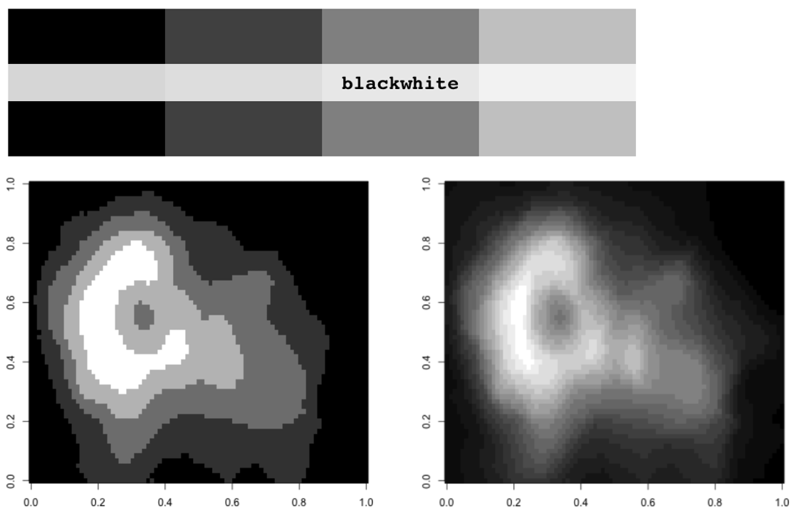
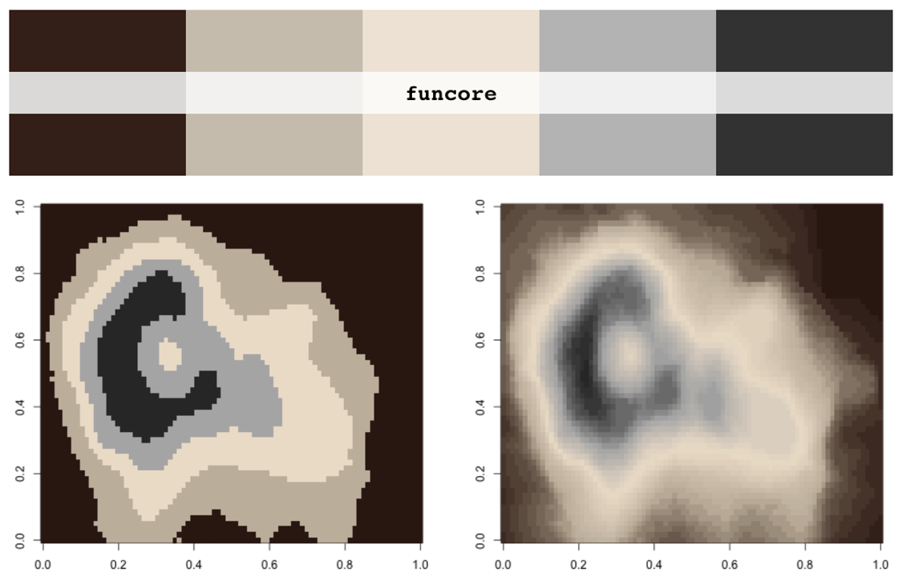
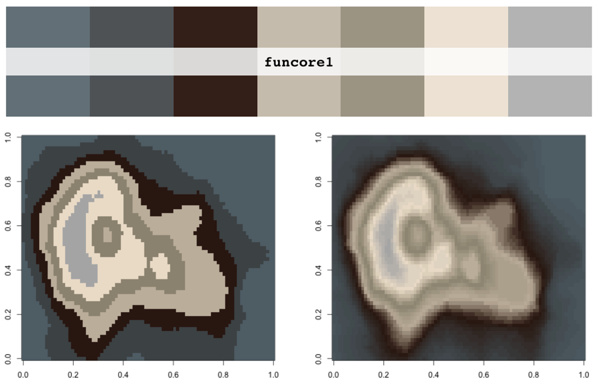
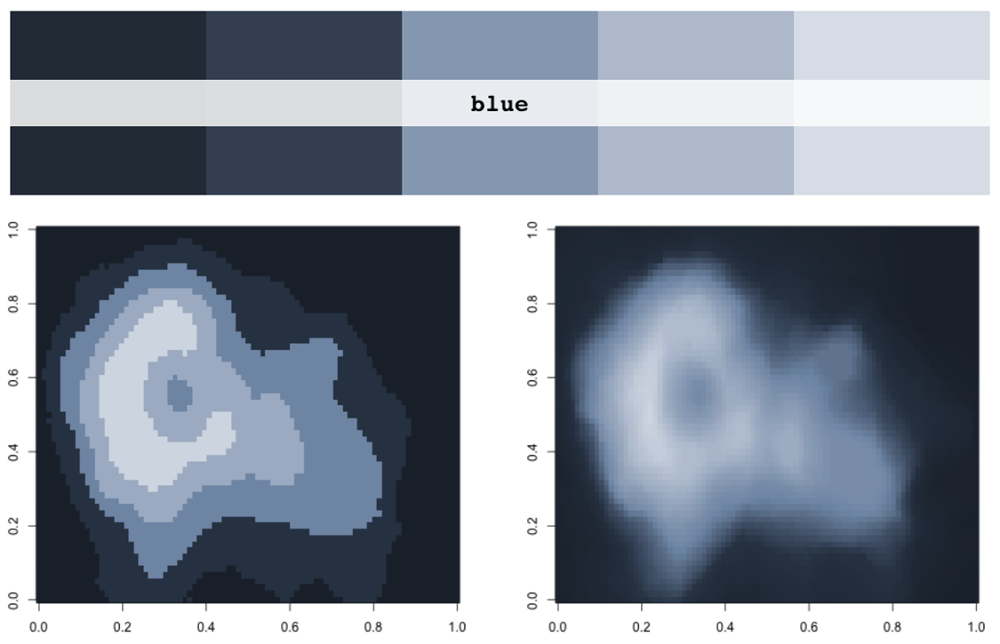
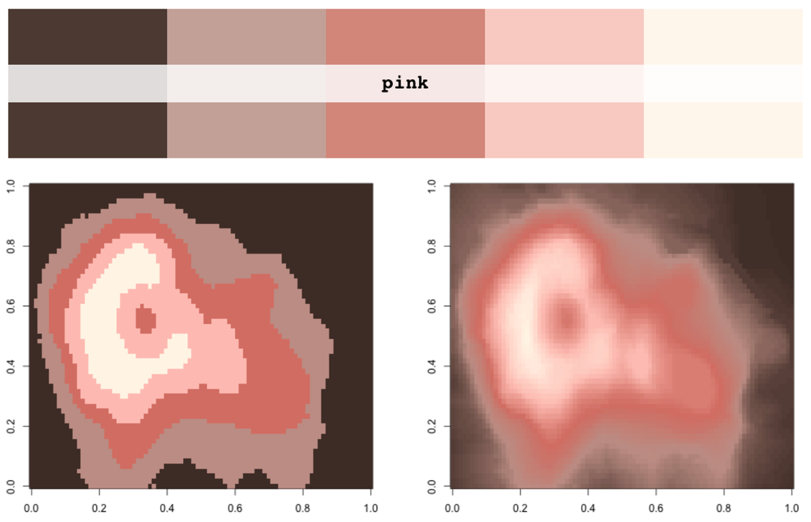
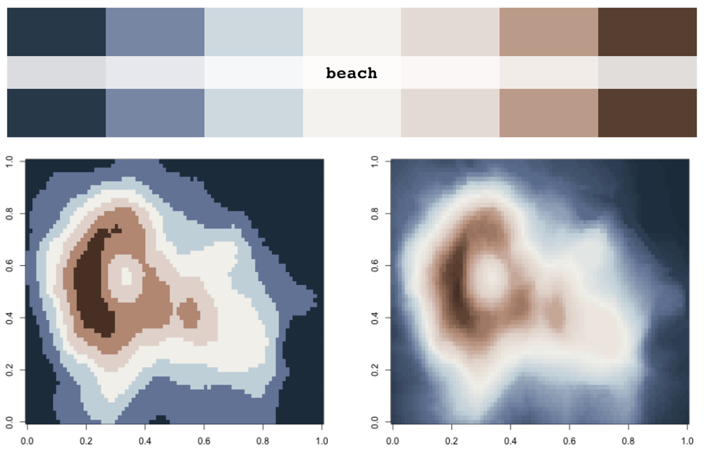
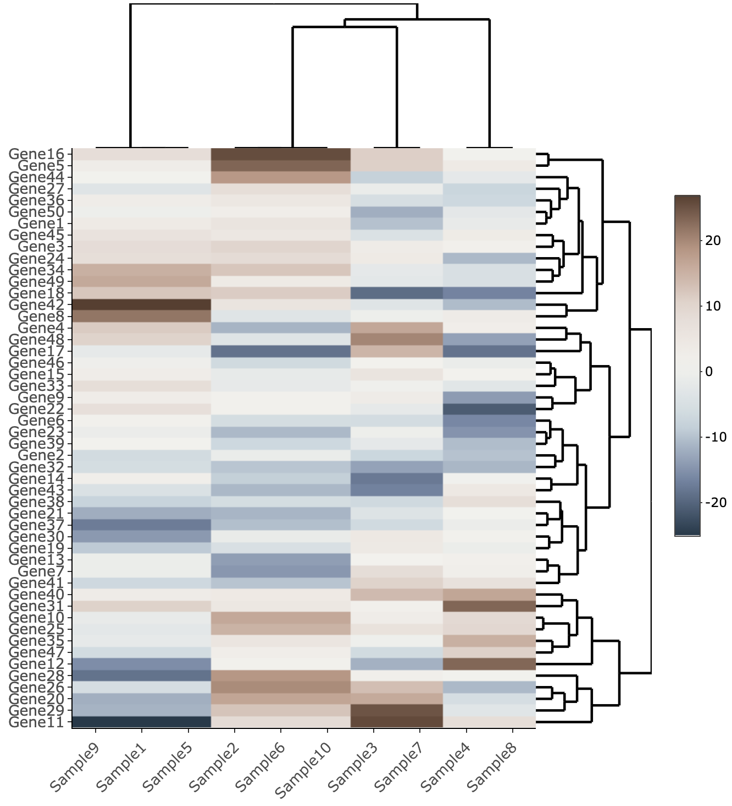

# pyltheme
 my colour palettes.


## Installation

```R
#library(remotes)
#remotes::install_github("beritlin/pyltheme")
library(pyltheme)
```


## Palettes

```R
# See all palettes
names(pyl_palettes)
# [1] "blackwhite" "funcore"    "funcore1"   "blue"       "pink"      
# [6] "beach"   
```


#### Blank and white

```R
pyl_palette("blackwhite")
image(volcano, col = pyl_palette("blackwhite"))
image(volcano, col = pyl_palette("blackwhite",n=20,type="continuous"))
```

<p align="center"></p>

#### Funcore

```R
pyl_palette("funcore")
image(volcano, col = pyl_palette("funcore"))
image(volcano, col = pyl_palette("funcore",n=50,type="continuous"))
```

<p align="center"></p>

#### FunCore1

```R
pyl_palette("funcore1")
image(volcano, col = pyl_palette("funcore1"))
image(volcano, col = pyl_palette("funcore1",n=50,type="continuous"))
```

<p align="center"></p>

#### Blue

```R
pyl_palette("blue")
image(volcano, col = pyl_palette("blue"))
image(volcano, col = pyl_palette("blue",n=100,type="continuous"))
```

<p align="center"></p>

#### Pink

```R
pyl_palette("pink")
image(volcano, col = pyl_palette("pink"))
image(volcano, col = pyl_palette("pink",n=100,type="continuous"))
```

<p align="center"></p>

#### Beach

```R
pyl_palette("beach")
image(volcano, col = pyl_palette("beach"))
image(volcano, col = pyl_palette("beach",n=100,type="continuous"))
```

<p align="center"></p>

### Example

```R
#install.packages("heatmaply")
library(heatmaply)
heatmaply(heatmap, colors = pyl_palette("beach",n=100,type="continuous"))
```

<p align="center"></p>

